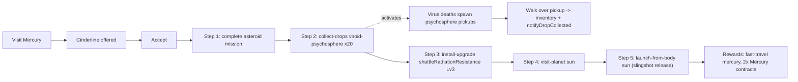

# The Cinderline contract

> Five-step Mercury contract that introduces two new step kinds
> (`collect-drops`, `launch-from-body`) and a contract-driven loot pipeline.

The Cinderline is the first contract that demands gameplay outside the
existing `complete-missions` / `install-upgrade` / `visit-planet` /
`orbital-mission` / `trade-goods` rotation. It also makes the **Sun** a
first-class visitable body, and exercises the new viroid-psychosphere drop
system in the FPS layer.

This document describes the chain, the engine extensions, and the contract
between the FPS layer and the contract system.

## Source data

- `src/data/contracts/the-cinderline.json` — the contract itself.
- `src/data/inventory/items.json` — adds `viroid-psychosphere` (consumable, weightless, max stack 99).
- `src/data/planets/planetarium.json` — adds `"id": "sun"` to the Sun block so it can be addressed as a planet id.

## Step chain



## New step kinds

### `collect-drops`

```ts
interface CollectDropsStep extends ContractStepRewardMixin {
  kind: 'collect-drops'
  itemId: string
  count: number
}
```

Advances by `event.quantity` per `notifyDropCollected({ itemId, quantity })`
event. Counter clamps at `count`, then the step satisfies. Only events whose
`itemId` matches the active step are counted.

### `launch-from-body`

```ts
interface LaunchFromBodyStep extends ContractStepRewardMixin {
  kind: 'launch-from-body'
  planetId: string
}
```

Advances when the player slingshot-releases out of orbit at a matching body.
Bodies are addressed by their stable id (`'sun'`, `'mercury'`, etc).

## New `ContractSystem` events

| Event | Payload | Notes |
|-------|---------|-------|
| `notifyDropCollected` | `{ itemId, quantity }` | Mirrors `notifyTradeTransaction` shape; advances any active `collect-drops` step whose `itemId` matches. |
| `notifyOrbitalLaunched` | `{ planetId }` | Wired to the slingshot release path in `MapOrbitFacade`. The Sun is special-cased in `MapViewController.notifyOrbitalLaunchFromBodyName` because it lives outside the `PLANETS` array. |

## Sun as a visitable body

`SunData` gains a `readonly id: string` (always `'sun'`). The `MapView.vue`
orbit watcher special-cases the Sun before falling back to the
`PLANETS.find(...)` lookup, so a stable solar orbit fires
`contractSystem.notifyPlanetVisited('sun')` exactly like any other planet.

`MapViewController.notifyOrbitalLaunchFromBodyName` does the same trick for
the slingshot release event so `Step 5: launch-from-body sun` resolves.

## FPS drop pipeline

The drop pipeline lives in `src/lib/fps/dropSystem.ts` and is intentionally
decoupled from both the contract system and the Three.js layer.

### `DropPolicy`

```ts
interface DropPolicy {
  isItemArmed(itemId: string): boolean
}
```

`createContractDropPolicy(contractSystem)` returns the production policy: a
drop is armed iff there is at least one **active** contract whose **current**
step is `kind === 'collect-drops'` matching the item id. Future contracts
that introduce new drop kinds will light up automatically as long as they use
the same step kind.

### `DropSystem`

`DropSystem` owns the live pickup list (`pickups: readonly PickupEntity[]`).
Three calls drive it:

- `spawnFor(itemId, position)` — attempted on every armed enemy death; gated
  by the policy.
- `tick(dt, playerPosition)` — every EVA frame. Removes pickups within
  `pickupRadius` of the player and fires `onPickup`.
- `clear()` — on level teardown.

The `onPickup` callback is the only thing the FPS layer needs to wire into
inventory + the contract system. In `LevelViewController.handlePickupCollected`
that's:

1. Load + write inventory via `addItem` (same path as mineral pickups).
2. Toast via `onResourcePickup` and play `levelAudio.notifyResourcePickup()`.
3. `contractSystem.notifyDropCollected({ itemId, quantity })`.

### Visualization

`PsychospherePickupController` (in `src/three/`) reconciles a `THREE.Group`
of bobbing emissive spheres with `dropSystem.pickups` every frame. Adding it
to the scene is enough; teardown is via `dispose()`.

### Enemy hookup

`Enemy.addDeathListener(fn)` provides an auxiliary multicast hook so the
drop system can subscribe without clobbering each controller's primary
`onDeath` handler. `EnemyDirector.addSpawnListener(fn)` lets observers
register globally per-director.

`ExterminateMinigame` and `RescueMinigame` both expose
`installEnemySpawnObserver(listener)` which forwards to their internal
director. `LevelViewController.installDropObserver(minigame)` maps
`enemy.type` → `itemId` (today: `bacteriophage` → `viroid-psychosphere`),
attaches a death listener, and asks the drop system to spawn at the enemy's
last position. New loot mappings live in
`LevelViewController.dropItemForEnemyType`.

## Tests

- `src/lib/contracts/__tests__/ContractSystem.spec.ts` covers
  `collect-drops` clamping, item-id filtering, and `launch-from-body`
  matching (including no-active-instance behavior).
- `src/lib/fps/__tests__/dropSystem.spec.ts` covers the policy gate,
  pickup-radius collection, drain semantics, listener isolation, and the
  contract-policy adapter.
- `src/lib/planets/__tests__/catalog.spec.ts` asserts `SUN.id === 'sun'`.

## Out of scope (follow-ups)

- Final art for the psychosphere icon and 3D pickup mesh — both are
  placeholders today.
- Mercury board doesn't currently offer combat/rescue contracts, so Step 1
  is fulfilled from any other asteroid mission. Adding asteroid givers tied
  to Mercury is its own scope.
- Removing the Cinderline weapon mod after Step 2 completes — current plan
  is to leave it armed only while Step 2 is the *current* step, so it
  auto-disarms on advance via the `DropPolicy`.
