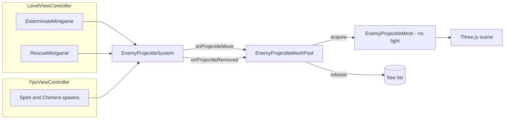

# FPS Scene Perf Fixes Design

**Date:** 2026-04-18
**Author:** guinetik
**Status:** Draft

## Overview

The FPS gameplay (asteroid `LevelViewController`, plus the standalone `FpsViewController` demo) lags noticeably during heavy combat — many enemies on screen, many enemy projectiles in flight, frequent impacts. This pass lands cheap wins inside the existing render/data layer so we get back to a stable frame rate, **without touching physics or collision code**. The collision rework (Rapier integration with convex-hull rocks, compound lander collider, kinematic character controller) is queued as a separate follow-up and explicitly out of scope here.

## Scope

**In scope:**
- Drop the per-projectile `THREE.PointLight` from `EnemyProjectileMesh`.
- Centralize a single `EnemyProjectileMeshPool` so the three callsites that currently `new` and `dispose()` per shot all reuse instances.
- Apply the pool in `ExterminateMinigame`, `RescueMinigame`, and `FpsViewController`.
- Hoist `Vector3` allocations out of impact / enemy-hit / hostage-hit / explosion callbacks in `LevelViewController`, both minigames, and `FpsViewController`. Document a transient-position contract on `ProjectileSystem`'s callback typedefs.
- Decouple the FPS camera from the player group's terrain-tilt rotation (`TERRAIN_TILT_FACTOR = 0`).
- Throttle per-enemy `Heightmap.normalAt` sampling for tilt visuals in both minigames and the demo (cache last sample per enemy id).

**Out of scope (deferred to the Rapier rework):**
- `worldCollision.ts`, `PlatformerBody` ground snap, `LanderController` lateral resolve, `SurfaceRockController` collider building.
- Compound colliders for the lander legs.
- Player capsule + Rapier `KinematicCharacterController`.
- Convex-hull rocks (chosen rock fidelity for that pass).
- Replacing the per-projectile point light with a single shared "hero" light tracking the closest projectile to the player. Possible follow-up if visuals read weak.

## Root cause ranking

Worst offender first.

### 1. Per-projectile `PointLight`

`EnemyProjectileMesh` currently constructs a fresh `THREE.PointLight` per instance. Three.js evaluates dynamic lights per-fragment per-material; with multiple Spires + Chimera firing in a real exterminate or rescue mission, dozens of dynamic lights stack up and tank GPU performance. This dwarfs every other issue.

### 2. No pool for `EnemyProjectileMesh`

`new EnemyProjectileMesh()` and `mesh.dispose()` per shot in three places:
- `src/lib/minigame/ExterminateMinigame.ts` (lines 326–341, plus disposal at 856–862)
- `src/lib/minigame/RescueMinigame.ts` (lines 326–341, plus disposal at 856–862)
- `src/views/FpsViewController.ts` (lines 401–417, plus disposal at 883–884)

Allocates geometry/material handles and (today) a `PointLight` every spawn. GC pressure plus repeated WebGL state churn.

### 3. `Vector3` allocations in impact / hit callbacks

Every callback site does the same shape:

```ts
const up = new Vector3(0, 1, 0)
for (let i = 0; i < N; i++) {
  emitter.emit(pos, up.clone().multiplyScalar(speed))
}
```

`ParticleEmitter.emit` already copies internally — passing a shared scratch vector is safe and equivalent. Today these allocate `1 + N` Vector3s per event, in:
- `LevelViewController.onImpact` (line 560–565)
- `ExterminateMinigame.onExplosion` (line 616–621)
- `RescueMinigame.onExplosion` (line 656–661)
- `FpsViewController.onImpact` / `onEnemyHit` / `onHostageBolt` / `onHostageHit` / `onPlayerHit`

Plus `ProjectileSystem` itself calls `pos.clone()` four times per frame per impact callback type.

### 4. Camera ↔ terrain-tilt feedback

`FpsCamera.tick` reads the player group's `target.rotation.x/z` (which is the platformer body's terrain conformance) and feeds a fraction of it back into the camera euler. Even at `TERRAIN_TILT_FACTOR = 0.15` this contributes to the "weird walking on uneven terrain" feel without giving real value (the player already has bob + roll wobble from velocity).

### 5. Per-enemy `Heightmap.normalAt` per frame

In both minigames and the demo, the per-enemy tilt loop calls `heightmap.normalAt()` every tick for every enemy. Each call is 4× `heightAt` + a sqrt, used purely for visual tilt. With many enemies this adds up. Visual tilt is indistinguishable at 15 Hz vs 60 Hz.

## Design

### `EnemyProjectileMesh` — drop the light, add lifecycle

```ts
class EnemyProjectileMesh {
  readonly group: THREE.Group
  setPosition(x: number, y: number, z: number): void
  setVisible(v: boolean): void
  reset(): void          // visible = true, position = (0,0,0)
  dispose(): void        // true teardown — pool calls this only on disposeAll()
}
```

No `PointLight`. The additive sphere stays. If projectiles read too dim, a follow-up can add one shared "hero" `PointLight` that tracks the closest projectile to the player.

### `EnemyProjectileMeshPool` — centralize the pattern

New file `src/three/EnemyProjectileMeshPool.ts`:

```ts
export class EnemyProjectileMeshPool {
  constructor(scene: THREE.Scene)

  /** Bind to EnemyProjectileSystem.onProjectileMove. */
  acquire(id: number, x: number, y: number, z: number): void

  /** Bind to EnemyProjectileSystem.onProjectileRemoved. */
  release(id: number): void

  /** Pre-allocate N meshes parked off-scene for the first burst. */
  prewarm(count: number): void

  /** Hard teardown — dispose every mesh and clear maps. */
  disposeAll(): void
}
```

Internals: a `Map<number, EnemyProjectileMesh>` for the active set + an array free list. `acquire` pops a free mesh (or creates one), adds to scene, sets position; `release` removes from scene, marks invisible, pushes to free list.

### Scratch-vector contract on `ProjectileSystem` callbacks

Update the `onImpact` / `onEnemyHit` / `onHostageBolt` typedefs:

```ts
/**
 * @param position - **Transient** scratch vector. Copy if you need to keep it
 *                   beyond the synchronous callback body. Mutated next call.
 */
onImpact: ((position: THREE.Vector3) => void) | null
```

Stop calling `pos.clone()` inside the system. Existing callers (LevelViewController, both minigames, FpsViewController) only consume the position synchronously to spawn particles or read coords, so no defensive copies needed.

### `FpsCamera` decoupling

```ts
const TERRAIN_TILT_FACTOR = 0
```

Or remove the `terrainPitch` / `terrainRoll` lerp branch outright. Either is equivalent; setting the constant to 0 keeps the diff small and reversible.

### Throttled normal sampling

Per-enemy cache shape, kept inside each minigame (and the demo VC):

```ts
interface EnemyTiltSample {
  x: number
  z: number
  rotX: number
  rotZ: number
}
private readonly tiltSamples = new Map<number, EnemyTiltSample>()
```

Resample when `(dx*dx + dz*dz) > NORMAL_RESAMPLE_DIST_SQ` (≈ 0.25 m²). Cache the resulting `rotation.x` / `rotation.z` so the per-frame work is just `Map.get` + two number assignments.

## Architecture diagram



## Validation

- `/level?mission=exterminate&difficulty=8` and a rescue mission, with multitool spam — frame rate should stay smooth where it previously dropped.
- `/fps?enemies&hostages=4` for the demo mirror.
- Visual sanity check: enemy projectiles still pop without their lights.
- Walking on uneven terrain should feel less disorienting after the camera-tilt change.
- `npm run typecheck` and `npm run lint` clean.

## Out of scope (next pass)

- Rapier integration (narrow scope: `worldCollision.ts` + bottom of `PlatformerBody`).
- Compound collider for the lander; convex-hull colliders for surface rocks.
- Player capsule + `KinematicCharacterController`.
- Optional shared "hero" point light tracking nearest projectile.

---

## v2 — render-cost pass

**Date:** 2026-04-18
**Status:** Implemented
**Trigger:** After v1 shipped, the user reported continued lag specifically when **rotating the camera with enemies on screen** in the `/level` mission. That's a GPU/render-cost signature, not the CPU/allocation signature v1 fixed. Scope was constrained to the asteroid mission level (`LevelViewController`) and to changes that cost no visual fidelity (or near-zero).

### Root cause #1 — Surface rocks always submitted to GPU

`SurfaceRockController` set `mesh.frustumCulled = false` on every rock `InstancedMesh`. With **250–1000** rocks across multiple `MeshStandardMaterial` (PBR) batches, every batch was unconditionally drawn each frame regardless of camera direction. Rotating away from the rocks freed nothing.

**Fix:** [src/three/controllers/SurfaceRockController.ts](../../../src/three/controllers/SurfaceRockController.ts)
- `mesh.frustumCulled = true`.
- `mesh.computeBoundingSphere()` immediately after `mesh.instanceMatrix.needsUpdate = true`, so the sphere encloses every placed instance instead of just the geometry origin. Without this, frustum culling would either over-cull (popping) or under-cull (silently no-op).

Invisible to the player — culled batches were drawing offscreen anyway.

### Root cause #2 — Spires render 64 spike meshes each

`SpireController` defined `SPIKE_COUNT = 32`, and each spike is **stalk + bulb** (two meshes). One Spire = 64 spike draws plus the membrane/core/RNA on top. A mission with 4 Spires = ~256 spike draws before anything else.

**Fix:** [src/three/SpireController.ts](../../../src/three/SpireController.ts)
- `SPIKE_COUNT = 16`. The Fibonacci-sphere distribution still reads as a coronavirus silhouette; the back hemisphere just thins out a bit.

If 16 still reads "spiky enough" we can drop further later, but 16 is the conservative call.

### Root cause #3 — HUD telemetry emitted at 60 Hz

`LevelViewController.tick()` built a fresh `objectives` array (with `.map(...)` allocating a `CompassObjective` per objective), wrapped it in a fresh `FpsTelemetry` literal, and handed it to Vue **every frame**. Vue then triggered reactivity through every text node and `:style` binding in `FpsHud.vue`. The heading display recomputed whenever the camera rotated — exactly the symptom.

**Fix:** [src/views/LevelViewController.ts](../../../src/views/LevelViewController.ts)
- Added `TELEMETRY_INTERVAL_S = 1 / 15` and a `telemetryAccumulator` field.
- Telemetry blocks (`onLanderTelemetry`, `onFpsTelemetry`, `onPlayerPosition` — both code paths) only run when the accumulator overflows.
- `onStateInfo` is left per-frame because it drives the action prompts (`canExfil`, `canEnterLander`).
- `enterLander()` and `enterEva()` set the accumulator to the interval value so the first tick after a state change still emits immediately (no HUD blank frame).

15 Hz is imperceptible for HUD readouts and is standard for telemetry overlays.

### Deferred again (still "safe-only" line)

Real wins, intentionally **not** taken in v2 because they nudge visuals:
- Killing per-enemy `PointLight`s on Bacteriophage / Spire / Chimera (biggest remaining win, but drops the small ground glow under enemies).
- Capping `devicePixelRatio` to 1.5 in `SceneManager`.
- Dropping `antialias: true` on `WebGLRenderer` (FXAA in `LevelPostProcessing` already covers edges in the level scene).
- Bloom / postprocess pass reduction.
- Helmet `SpotLight` intensity / distance reduction.

If the rotation lag isn't fully gone after v2, the next pass should pick from this list.

### Validation (v2)

- Boot `/level?mission=exterminate&difficulty=8`, walk into the encounter, rotate the camera through the enemy cluster — frame time should stop spiking.
- Confirm rocks still appear when looking at them (only the *cost* should change, not visibility).
- Confirm Spires still read as spiky.
- Confirm HUD numbers still update visibly (just at 15 Hz, which feels normal).
- `npm run lint` clean on touched files.

---

## v3 — shader pre-compile warmup

**Date:** 2026-04-18
**Status:** Implemented
**Trigger:** After v2 shipped, the user reported **3-second RAF stalls** when just rotating the camera. v2's steady-state was fine (the GPU/render-cost wins held), but the rotation hitches got worse — not better. Investigation traced it to a regression caused by v2's own rocks-cull fix.

### Root cause — deferred shader compilation

Three.js compiles shader programs lazily: the GLSL is compiled and linked the **first time** a material is actually drawn. For `MeshStandardMaterial` (PBR — what every rock uses) and the dozens of TRON `ShaderMaterial` variants (one per enemy body part, particle emitter, projectile, etc.) this is a real, blocking, multi-hundred-millisecond — sometimes multi-second — main-thread stall on a cold GPU shader cache.

Before v2, `SurfaceRockController` set `frustumCulled = false` on every rock `InstancedMesh`. As a side effect, **every rock batch's shader compiled during the first frame after level load** — i.e. while the loading screen / mission intro was still on screen. The user never saw the hitch.

After v2, `frustumCulled = true` (correctly) defers the *first draw* of every off-camera rock batch until rotation brings it into view. **That defers the shader compile too.** Result: every time the camera swept onto a previously-uncompiled batch, ~3s freeze. The very fix that made steady-state cheaper made first-encounter expensive.

The same pattern applies to enemies (membrane / core / RNA / stalk / bulb / hull / neck / head / leg shaders), the exterminate crater (built `visible = false` until detonation), pooled projectiles that haven't been spawned yet, and any other mesh that wasn't on screen during the first post-load frame.

### Fix

[src/views/LevelViewController.ts](../../../src/views/LevelViewController.ts) now calls `renderer.compileAsync(scene, camera)` once at the **end of `init()`**, immediately before `gameLoop.start()`. By then every static system is in the scene tree:

- terrain mesh
- surface rocks (all batches)
- lander, multitool, FPS player, arrival shuttle
- minigame world objects (nest / virus / hostages / crater)
- enemies — `ExterminateMinigame.create` and `RescueMinigame.create` both run `spawnEncounter()` in their constructor, which is awaited in `init()`
- post-processing pipeline
- shared particle emitters and projectile pools

Three.js's `compile()` walks the scene with `traverse` (not `traverseVisible`), so hidden meshes get warmed up too — that covers the exterminate crater and any pre-pooled projectile mesh.

`compileAsync` returns a Promise that resolves when every program reports ready. Where the `KHR_parallel_shader_compile` extension is available (modern Chromium / desktop GPUs) the compile happens off-thread and the await is essentially free. Where it isn't, the work still happens at load time — exactly when the user is looking at the loading screen / mission intro, not when they're rotating the camera mid-fight.

The new helper is `LevelViewController.precompileShaders()`. It picks the FPS camera by preference (most permissive layer mask), falls back to the vehicle camera, and finally to whatever `SceneManager.activeCamera` is. The choice of camera does **not** affect which materials get compiled — only the light/fog config the program is built against. Failures `console.warn` and continue: gameplay still works, just with the v2-era hitches.

### Why this also helps things that aren't rocks

- **TRON enemy shaders.** Spire/Bacteriophage/Chimera each contribute ~5–11 unique `ShaderMaterial` programs. With the warmup, those compile once at init regardless of whether the enemy spawned facing the camera.
- **Particle/projectile pools.** Pre-pooled meshes are in the scene but invisible — `traverse` reaches them.
- **Hostages.** Each has its own deep-cloned material set; warmup compiles them all at once instead of one-per-rescue.

### Light-visibility wrinkle (the actual fix)

The first cut of v3 just called `compileAsync`, but the user reported the rotation hitches were still there. The real culprit is more subtle.

Three.js's `compile()` walks materials with `traverse` (sees hidden meshes, good) but walks lights with **`traverseVisible`** (skips hidden lights). Several lights in `/level` start `visible = false`:

- `FpsCamera.helmetLightRig` → `SpotLight`, flips on in `enterEva()`.
- `ThrusterWashController.washLight` → `SpotLight`, flips on when the lander thrusts.
- `ExterminateMinigame.explosionLight` → `PointLight`, flips on per detonation.
- `RescueMinigame.explosionLight` → `PointLight`, flips on per detonation.

So the warmup compiled every PBR material with `NUM_SPOT_LIGHTS = 0`, `NUM_POINT_LIGHTS = 0`. The moment EVA started, the helmet light flipped visible, every standard material's program key changed (`NUM_SPOT_LIGHTS = 1`), and **Three.js queued a recompile for each material to be applied the next time it's drawn**. For frustum-culled rock batches that next draw is during a camera rotation that brings them into view — exactly the multi-second stall.

Fix: snapshot every light's visibility, force them all `visible = true`, run `compileAsync`, restore. Now the warmup compiles each material's program for the **maximum** light count the player will encounter, so any light flipping on later reuses the already-warmed program with no recompile. See `LevelViewController.precompileShaders()` for the implementation.

### Limitations

- **Light counts greater than the warmup max.** If a future system stacks more concurrent lights than the warmup snapshot covered, those extras still trigger recompile on first draw. Today the max is sun + helmet + wash + explosion ×2, all of which are in the scene at init time and get covered by the snapshot.
- **Truly dynamic meshes.** If a future system spawns a mesh with a brand-new material in `tick()`, it will still hitch on first display. Solution then is to pre-create one instance during init and let `traverse` find it.
- **Texture upload.** `compileAsync` warms the shader, not the texture. Async-loaded textures (terrain albedo, rock albedos) can still cause a small first-draw stall when their first sample happens. Probably below the perception threshold; revisit if it isn't.

### Validation (v3)

- Boot `/level?mission=exterminate&difficulty=8`. Mission intro should feel ~0.5–1s longer on cold cache (warmup time) — that's the cost we want.
- Walk into the encounter. Rotate the camera through enemies, surface rocks, the nest. **No 3s RAF stalls.**
- Trigger an explosion (kill a nest); subsequent rotations after the explosion light flickers should still be smooth.
- Subsequent loads on the same browser session should be near-instant (browser-side shader cache).
- `npm run lint` clean on touched files.

---

## v4 — last lazy material + accepted-fidelity trade-offs

**Date:** 2026-04-18
**Status:** Implemented
**Trigger:** After v3, the user reported the situation was **better** but rotation still felt laggy — *even with all enemies cleared*. "Hitches, less than before." Two distinct problems:

1. One last lazy material the warmup couldn't see — the player projectile pool.
2. Steady-state GPU cost from PBR + shadows + full DPR + post-FX. The "safe-only" line from v2 left these on the table; the user opted in to a few specific trade-offs to crack the remaining lag.

### Root cause #1 (last hitch source) — player projectile pool starts empty

`ProjectileSystem` allocated `Projectile` objects lazily inside `spawn()`:

```ts
const projectile = this.pool.pop() ?? this.createProjectile()
// ... mesh.visible = true; this.scene.add(mesh)
```

`createProjectile()` builds a brand-new `ShaderMaterial` (custom GLSL bolt). Because the pool starts empty, those meshes are **not in the scene tree** when `precompileShaders()` runs at end of `init()`. The first time the player fires, Three.js sees a never-rendered material and **compiles its program synchronously on the next render call** — visible as a hitch the first time the player fires while turning. (And again every time the pool was emptied and grew.)

It also added/removed each mesh from the scene per shot, which is unnecessary scene-graph churn.

#### Fix

[src/lib/fps/projectileSystem.ts](../../../src/lib/fps/projectileSystem.ts)
- New `prewarmPool(count = 16)` method: builds `count` projectiles up front, **adds their meshes to the scene as invisible**, and pushes them into the pool. The end-of-init `compileAsync` walk then sees the bolt material (it traverses with `traverse`, not `traverseVisible`) and compiles its program before the game loop starts.
- `spawn()` only calls `scene.add` for projectiles created on overflow (i.e. above the prewarm count). Pooled meshes stay in the scene; only their `visible` flag toggles.
- `removeProjectile()` no longer calls `scene.remove` — same reasoning.
- `dispose()` now removes the prewarmed pool meshes from the scene before disposing materials.

[src/views/LevelViewController.ts](../../../src/views/LevelViewController.ts) — calls `this.projectileSystem.prewarmPool()` immediately after constructing the system.

### Root cause #2 (steady-state cost) — accepted-fidelity changes

The user picked four trade-offs from the v2 deferred list. None individually huge, but stacked they cut a meaningful chunk of fragment-shader cost.

#### a) Cap `devicePixelRatio` to 1.5

[src/three/SceneManager.ts](../../../src/three/SceneManager.ts) — `setPixelRatio(Math.min(window.devicePixelRatio, 1.5))`.

Single biggest win. On a hi-DPI display (DPR 2) the GPU was rendering 4× the logical pixel count, and PBR + shadow lookup + post-processing all scale with fragment count. 1.5 keeps text/UI clearly sharper than 1.0 (visually negligible blur) but drops fragment cost ~44% vs DPR 2.

#### b) Disable rock `castShadow`

[src/three/controllers/SurfaceRockController.ts](../../../src/three/controllers/SurfaceRockController.ts) — `mesh.castShadow = false` on every rock `InstancedMesh`. `receiveShadow` stays on, so the lander/character/sun shadows still land on rocks.

With 250–1000 rocks across multiple `InstancedMesh` batches, the shadow pass was effectively rendering every rock twice per frame (once into the shadow map, once into the colour buffer). Cutting that in half is large, and the loss is just self-shadowing detail on rock-on-rock contact, which the eye doesn't track in motion.

#### c) Helmet `SpotLight` distance 240 → 120

[src/three/FpsCamera.ts](../../../src/three/FpsCamera.ts) — `HELMET_LIGHT_DISTANCE = 120`.

Spotlight cost is per-fragment within the cone. The previous range covered fragments well past the player's interaction radius, contributing nothing visible but plenty of work. 120 still reads as "headlamp filling the immediate look direction".

#### d) Shadow map 2048 → 1024

[src/three/atmosphere/LevelLightingRig.ts](../../../src/three/atmosphere/LevelLightingRig.ts) — `SHADOW_MAP_SIZE = 1024`.

Shadow render pass is fragment-bound on the map size, so 1024 is ¼ the rasterisation cost vs 2048. Edges become slightly chunkier on long shadows; against the rocky terrain the difference is hard to spot.

### What's still on the deferred-but-untaken list

The user explicitly didn't pick these in the v4 trade-off poll:

- Drop renderer MSAA (`antialias: false`). FXAA in `LevelPostProcessing` already covers edges, so this is purely a quality-vs-perf trade. Pick if v4 isn't enough.
- Bloom strength / chromatic aberration / vignette pass reduction. Cheaper post-FX, slight reduction in glow.
- Killing per-enemy `PointLight`s (still on the original v2 list).

### Validation (v4)

- Boot `/level?mission=exterminate&difficulty=8`. Confirm visual delta (small DPR drop, no rock-on-rock shadows, slightly chunkier sun shadow edge, smaller helmet halo on the ground far ahead).
- Fire the multitool while turning the camera **on the very first shot** of a session. No first-fire hitch.
- Clear all enemies. Rotate the camera. Steady-state should feel noticeably smoother.
- `npm run lint` clean on touched files.

### If hitches still persist after v4

The remaining suspects are almost certainly outside the static scene path:

- **Texture upload / decode.** `compileAsync` doesn't warm textures. Async-loaded textures can stall on first sample.
- **InstancedMesh re-uploads.** If anything we haven't audited toggles `instanceMatrix.needsUpdate = true` per frame, that's a buffer re-upload on the GPU each frame.
- **GPU command queue stall.** When the GPU falls far enough behind, the browser forces a flush and the main thread blocks until the queue drains.
- **Major GC.** Long sessions can accumulate enough heap to trigger a multi-hundred-millisecond GC sweep.

The fastest way to differentiate is a Chrome DevTools Performance recording during a hitch — the long-task label tells us which bucket it's in (`compileShader`, `texImage2D`, `bufferData`, "Major GC", or just a long "GPU" track with idle Main).

## v5 — Procedural enemy churn (in-place tube updates + LOD + light cap)

### Why a v5

After v4 the user reported the empty-arena case is fine ("better. at least regarding the area when there are no enemies"), but **with enemies on screen** the camera rotation still feels clunky.

A focused audit of the procedural enemy controllers found a steady-state bottleneck that the earlier rounds didn't touch: **the chimera and bacteriophage rebuild every limb tube `BufferGeometry` from scratch every few frames.** The old code looked like:

```ts
mesh.geometry.dispose()
mesh.geometry = new THREE.TubeGeometry(curve, axial, radius, radial, false)
```

Per chimera per second:

- Legs: 4 legs × 2 tubes × 7 Hz = **56** `TubeGeometry` constructions.
- Tentacles: 10 tentacles × 4 segments × 5 Hz = **200** `TubeGeometry` constructions.
- **≈256 `TubeGeometry` allocations per chimera per second.**

Each allocation builds fresh `Float32Array`s for `position`/`normal`/`uv`, builds a fresh index buffer, uploads them all to a brand-new GPU VBO, then the previous geometry is disposed and its VBO recycled. With 2-4 chimeras visible the steady-state cost is 500-1000 geometry rebuilds/sec — meaningful GC pressure on the main thread plus a constant trickle of `bufferData` calls into the GL driver. Bacteriophages add another ~24/s each. None of this is visible during normal gameplay because the topology and radius of every tube are *constant*; only the curve changes.

A second contributor is per-enemy `PointLight`s: spire (1), bacteriophage (1), chimera (2). With 8-12 enemies that's 8-12 dynamic point lights all bumping `NUM_POINT_LIGHTS` in the program defines (fine — v3 warms for max) and, more importantly, adding per-fragment shading branches on every PBR surface inside their `distance`. The lights closest to the player carry visual weight; the distant ones don't.

### What the user accepted (v5 trade-offs)

In the post-v4 follow-up:

- **Enemy geometry churn**: "Both — in-place updates AND distance gate (max win)".
- **Per-enemy `PointLight`s**: "Cap to N nearest enemies (others go invisible) — distant enemies don't glow".
- **Scope**: "Full — implement everything I picked even if it's bigger".

### What changed (v5)

#### a) `MutableTubeGeometry` — in-place tube buffers

[src/three/geometry/MutableTubeGeometry.ts](../../../src/three/geometry/MutableTubeGeometry.ts) — a `BufferGeometry` subclass with the same vertex layout as `THREE.TubeGeometry` whose `position` / `normal` arrays are rewritten in place every refresh. Indices and UVs are computed once in the constructor; they never change because the topology of a tube of fixed `(tubularSegments, radialSegments, closed)` is invariant.

`update(curve)` walks the same loop `THREE.TubeGeometry` would, sampling `getPointAt(u)` and `computeFrenetFrames(...)` to build radial vertices, then writes them straight into the existing `Float32Array`s and sets `needsUpdate = true`. No `dispose`, no fresh VBO, no `BufferGeometry` allocation, no GC pressure.

The class only handles **constant radius** tubes, which is the only case the project has today — phage legs, chimera leg upper/lower, each chimera tentacle segment all have a fixed radius for their lifetime.

#### b) Wire it into `BacteriophageController` and `ChimeraWalkerController`

[src/three/BacteriophageController.ts](../../../src/three/BacteriophageController.ts), [src/three/ChimeraWalkerController.ts](../../../src/three/ChimeraWalkerController.ts) — every `new THREE.TubeGeometry(...)` site replaced with a one-time `MutableTubeGeometry` per mesh, plus `tube.update(curve)` in the per-frame refresh, the death animation, and the construction.

Each `LegData`/`ChimeraLeg` now holds a reference to the underlying `MutableTubeGeometry` so the per-frame code path is just curve-build + `tube.update(curve)`.

#### c) Distance LOD on geometry rebakes

Both controllers now expose a `lodSkipGeometry: boolean` flag. When `true`, the per-frame "should I refresh the limbs?" branch is skipped entirely — the static last-pose stays on screen, no GPU upload happens, no curve math runs. The minigame VC sets it every tick from the player-to-enemy XZ distance: > 50 m → `true`.

The death animation intentionally ignores the flag (it's a one-shot ~1.2 s and the corpse pose has to settle).

#### d) `setLightsEnabled` on enemy controllers

[src/three/SpireController.ts](../../../src/three/SpireController.ts), [src/three/BacteriophageController.ts](../../../src/three/BacteriophageController.ts), [src/three/ChimeraWalkerController.ts](../../../src/three/ChimeraWalkerController.ts) — each enemy controller exposes `setLightsEnabled(enabled)` that toggles `THREE.PointLight.visible` on its interior light(s). Hidden lights are skipped at render time and contribute zero per-fragment cost (they still count for the program's `NUM_POINT_LIGHTS`, which is why we still warm for max in v3).

#### e) `EnemyLodApplier` — single-pass distance + light cap

[src/lib/fps/enemyLodHelper.ts](../../../src/lib/fps/enemyLodHelper.ts) — a small per-minigame helper that owns one reusable scratch buffer. Every tick:

1. `begin(playerX, playerZ)` — reset.
2. `consider(handle, ctrl)` for each live controller — computes `distSq`, sets `lodSkipGeometry`, queues into the scratch buffer.
3. `commit()` — sorts the buffer by distance and calls `setLightsEnabled(i < ENEMY_MAX_LIVE_LIGHTS)` on each entry, keeping only the closest 4 enemies' lights enabled.

Wired into [`ExterminateMinigame`](../../../src/lib/minigame/ExterminateMinigame.ts), [`RescueMinigame`](../../../src/lib/minigame/RescueMinigame.ts), and (for parity in the demoscene) [`FpsViewController`](../../../src/views/FpsViewController.ts), all called **before** the per-controller tick loop so the LOD flag is observed in the same frame.

### Why this should fix the remaining clunk

- The dominant per-frame cost when enemies are visible is **gone** — `MutableTubeGeometry.update` does ~20× less work than `dispose() + new TubeGeometry()` because it only rewrites two attribute arrays whose memory is already allocated and already on the GPU.
- For enemies the player can't see moving (> 50 m), even that work is **skipped entirely**.
- The number of dynamic `PointLight`s contributing to fragment shading is capped at **4** regardless of how many enemies are alive.

### What's still on the deferred-but-untaken list

- Killing per-enemy point lights entirely (user picked "cap to nearest" rather than "drop").
- Drop renderer MSAA (`antialias: false`). FXAA already covers edges.
- Bloom strength / chromatic aberration reduction.

### Validation (v5)

- Boot `/level?mission=exterminate&difficulty=8`. Engage the encounter so 5+ enemies are visible. Rotate the camera around them — should feel noticeably smoother than v4.
- Move > 50 m away from a chimera. Its limbs should freeze in their last pose (still visible, just no wiggle). Walk back inside 50 m — they animate again.
- With > 4 enemies on screen, sweep the camera and notice that only the 4 nearest cast their interior glow on nearby surfaces.
- Death animations still play normally even at distance (intentional — they're one-shot).
- `npm run lint` clean on touched files.
